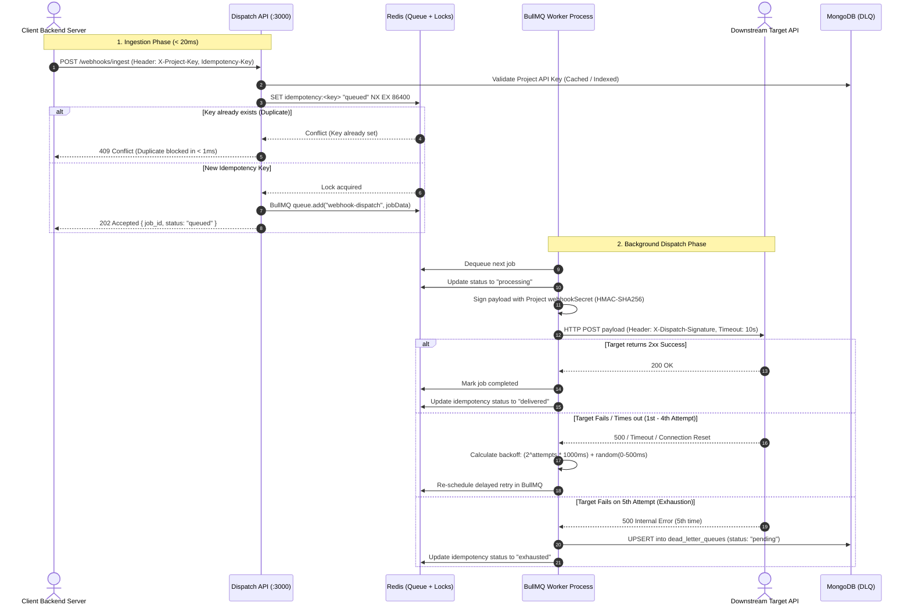
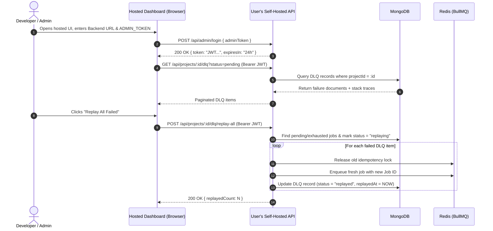

# Architecture Document — Dispatch Queue Engine

> **Self-Hosted Webhook Dispatcher with Bring-Your-Own-Backend (BYOB) Hosted Management UI**  
> *From Low-Level Implementation to Distributed High-Level System Design*

---

## 1. High-Level Design (HLD)

### 1.1 What This System Is

**Dispatch Queue Engine** is a self-hosted, enterprise-grade asynchronous webhook dispatcher and background delivery service. Any engineering team can deploy it within their own infrastructure (via Docker Compose) and connect to it from their application backends.

Instead of writing custom retry loops, jitter calculations, dead-letter storage, idempotency locks, and HMAC payload signatures in every microservice, client applications delegate delivery to this engine via a single HTTP call (`POST /webhooks/ingest`).

### 1.2 The Architecture Model: Hosted UI + Self-Hosted Backend (BYOB)

The system is decoupled into two distinct layers:
1. **Self-Hosted Engine (User Infrastructure)**: Runs the Express API, BullMQ Worker, Redis 7, and MongoDB 7 completely inside the user's private network or VPC.
2. **Hosted Admin Dashboard (BYOB Web Client)**: A static, client-side Single-Page Application (SPA) hosted centrally (e.g., via Vercel or GitHub Pages). Users open this dashboard in their browser, provide their self-hosted backend URL (`http://localhost:3000` or `https://dispatch.company.com`) along with their `ADMIN_TOKEN`, and manage projects and DLQs directly from their browser.

```
┌───────────────────────────────────────────────────────────────────────────┐
│                      CENTRAL / PUBLIC WEB LAYER                           │
│                                                                           │
│   ┌───────────────────────────────────────────────────────────────────┐   │
│   │ Hosted Admin UI (Static SPA) — Vercel / GitHub Pages              │   │
│   │ • 100% Client-Side Execution in Browser                           │   │
│   │ • $0 Hosting / Zero Maintenance / Zero Customer Data Stored       │   │
│   └─────────────────────────────────┬─────────────────────────────────┘   │
└─────────────────────────────────────┼─────────────────────────────────────┘
                                      │ Client-side HTTPS / REST calls
                                      │ (Bearer Admin JWT)
┌─────────────────────────────────────┼─────────────────────────────────────┐
│ USER'S PRIVATE INFRASTRUCTURE       │                                     │
│ (Self-Hosted via Docker Compose)    ▼                                     │
│ ┌─────────────────────────────────────────────────────────────────────┐   │
│ │ Dispatch API Container (Port 3000)                                  │   │
│ │ • Express.js + TypeScript                                           │   │
│ │ • Admin JWT Auth (/api/admin/*)                                     │   │
│ │ • Project & DLQ Control Plane (/api/projects/*)                     │   │
│ │ • Idempotent Webhook Ingestion (/webhooks/ingest)                   │   │
│ └──────────────┬──────────────────────────────────────┬───────────────┘   │
│                │ Enqueue & Lock                       │ Read/Write        │
│                ▼                                      ▼                   │
│        ┌──────────────┐                       ┌──────────────┐            │
│        │   Redis 7    │                       │  MongoDB 7   │            │
│        │  BullMQ +    │                       │  Projects +  │            │
│        │ Idempotency  │                       │  DLQ Records │            │
│        └───────▲──────┘                       └───────▲──────┘            │
│                │ Dequeue                              │ Failed (5x)       │
│ ┌──────────────┴──────────────────────────────────────┴───────────────┐   │
│ │ Dispatch Worker Container (Separate Process)                        │   │
│ │ • BullMQ Processor with Concurrency Controls                       │   │
│ │ • Exponential Backoff + Random 0-500ms Jitter                       │   │
│ │ • Per-Project HMAC-SHA256 Payload Signing                          │   │
│ │ • Automatic DLQ Write on Final Exhaustion                           │   │
│ └──────────────┬──────────────────────────────────────────────────────┘   │
└────────────────┼──────────────────────────────────────────────────────────┘
                 │ HTTP POST + X-Dispatch-Signature (10s Hard Timeout)
                 ▼
     ┌────────────────────────────────────────────────────────┐
     │ Downstream Target Services (Slack, Stripe, CRM, APIs)  │
     └────────────────────────────────────────────────────────┘
```

### 1.3 Component Responsibilities

| Component | Responsibility | Technology | Execution Location |
|---|---|---|---|
| **Hosted Admin UI** | Client-side visual dashboard for managing projects, credentials, DLQ inspection, and triggering retries. | React / Vite / SPA | User Browser (Static Host) |
| **API Server** | Validates incoming webhooks, validates project keys, acquires atomic Redis locks, enqueues BullMQ jobs, and exposes admin control APIs. | Express.js / TypeScript | User Docker (`dispatch_api`) |
| **Redis** | In-memory job queue broker (BullMQ), atomic idempotency lock coordinator, and transient event status tracker. | Redis 7 Alpine | User Docker (`dispatch_redis`) |
| **Worker Process** | Isolated background processor pulling jobs from BullMQ, executing HTTP delivery with exponential jittered retries and cryptographic signatures. | Node.js / BullMQ | User Docker (`dispatch_worker`) |
| **MongoDB** | Persistent datastore for registered projects, project API keys, HMAC secrets, and permanent Dead-Letter Queue (DLQ) records. | MongoDB 7 | User Docker (`dispatch_mongo`) |

---

## 2. Detailed End-to-End Request Flows

### 2.1 Webhook Ingestion & Execution Lifecycle



### 2.2 Hosted UI Admin Management & DLQ Replay Flow



---

## 3. Low-Level Design (LLD)

### 3.1 MongoDB Data Models & Schemas

#### Projects Collection (`projects`)
Enables multi-tenancy and credential segregation. Each project has an isolated API key for ingestion and a dedicated cryptographic secret for signing payloads.

```typescript
// Mongoose Schema: src/db/models/project.model.ts
{
  name: { type: String, required: true, trim: true, maxlength: 100 },
  slug: { type: String, required: true, unique: true, index: true, lowercase: true },
  apiKey: { type: String, required: true, unique: true, index: true },
  webhookSecret: { type: String, required: true },
  description: { type: String, default: '', maxlength: 500 },
  status: { type: String, enum: ['active', 'archived'], default: 'active', index: true },
  createdAt: { type: Date, default: Date.now },
  updatedAt: { type: Date, default: Date.now }
}
// Index: { status: 1, createdAt: -1 }
```

#### Dead-Letter Queue Collection (`dead_letter_queues`)
Persists exhausted jobs with complete operational context, execution metrics, and full error stack traces.

```typescript
// Mongoose Schema: src/db/models/dlq.model.ts
{
  projectId: { type: Schema.Types.ObjectId, ref: 'Project', required: true, index: true },
  projectSlug: { type: String, required: true, index: true },
  jobId: { type: String, required: true, unique: true, index: true },
  idempotencyKey: { type: String, required: true, index: true },
  targetUrl: { type: String, required: true },
  payload: { type: Schema.Types.Mixed, required: true },
  attemptsMade: { type: Number, required: true, default: 0 },
  lastError: {
    message: { type: String, required: true },
    code: { type: String },
    stack: { type: String },
    timestamp: { type: Date, default: Date.now }
  },
  status: { 
    type: String, 
    enum: ['pending', 'replaying', 'replayed', 'exhausted'], 
    default: 'pending', 
    index: true 
  },
  replayedAt: { type: Date },
  replayedJobId: { type: String },
  createdAt: { type: Date, default: Date.now },
  updatedAt: { type: Date, default: Date.now }
}
// Compound Index: { projectId: 1, status: 1, createdAt: -1 }
// Compound Index: { projectSlug: 1, createdAt: -1 }
```

### 3.2 Idempotency Engine & Key Lifecycle

**Service:** `src/services/idempotency.service.ts`

The engine enforces a 24-hour guarantee against duplicate webhook delivery using Redis atomic operations:

```
Step 1: Check and Acquire Lock
  redis.set(`idempotency:${key}`, 'queued', 'NX', 'EX', 86400)
  ├── Returns "OK" → Key is unique, proceed to BullMQ enqueue.
  └── Returns null → Key exists (duplicate). Reject immediately with 409 Conflict (< 1ms).

Step 2: Lifecycle Transitions
  • 'queued'     → Job is waiting in Redis queue.
  • 'processing' → Worker has dequeued the job and initiated the HTTP request.
  • 'delivered'  → Target returned 2xx. Lock remains to block repeat submissions for 24h.
  • 'exhausted'  → All 5 attempts failed; payload logged to DLQ.
```

### 3.3 Jittered Exponential Backoff Policy

**Service:** `src/config/queue.ts`

To eliminate the "thundering herd" problem where hundreds of failing webhooks retry simultaneously and overwhelm downstream destinations, every retry incorporates randomized jitter:

$$\text{Delay}(n) = \left(2^n \times 1000\text{ ms}\right) + \text{Random}(0, 500\text{ ms})$$

| Attempt | Base Delay | Random Jitter | Total Delay Window |
|---|---|---|---|
| **Attempt 1** | 0ms | 0ms | Immediate |
| **Attempt 2** | $2^1 \times 1000 = 2000\text{ms}$ | 0–500ms | 2.0s – 2.5s |
| **Attempt 3** | $2^2 \times 1000 = 4000\text{ms}$ | 0–500ms | 4.0s – 4.5s |
| **Attempt 4** | $2^3 \times 1000 = 8000\text{ms}$ | 0–500ms | 8.0s – 8.5s |
| **Attempt 5** | $2^4 \times 1000 = 16000\text{ms}$ | 0–500ms | 16.0s – 16.5s |
| **Exhaustion** | Move to DLQ | — | Stored in MongoDB |

### 3.4 Cryptographic Payload Signing (HMAC-SHA256)

**Service:** `src/services/signer.service.ts`

Every outgoing HTTP request sent to target endpoints includes an authenticating signature header:
```
X-Dispatch-Signature: sha256=<hex_digest>
```
The signature is computed using the project's unique `webhookSecret` (or global fallback):
```typescript
const hmac = crypto.createHmac('sha256', projectWebhookSecret);
const signature = hmac.update(JSON.stringify(payload)).digest('hex');
```

Downstream services verify authenticity using timing-safe comparisons:
```javascript
const expected = crypto.createHmac('sha256', secret).update(rawBody).digest('hex');
const isValid = crypto.timingSafeEqual(Buffer.from(receivedSig), Buffer.from(expected));
```

---

## 4. API Specification & Security Contracts

### 4.1 Admin Authentication & Analytics

* **`POST /api/admin/login`**
  * Body: `{ "adminToken": "<ADMIN_TOKEN>" }`
  * Response `200`: `{ "status": "success", "data": { "token": "<JWT>", "expiresIn": "24h", "role": "admin" } }`
* **`GET /api/admin/me`**
  * Headers: `Authorization: Bearer <JWT>`
  * Response `200`: Verifies token and returns session context.
* **`GET /api/admin/stats`**
  * Headers: `Authorization: Bearer <JWT>`
  * Response `200`: `{ "projects": { "total": 5, "active": 4, "archived": 1 }, "dlq": { "pending": 12, "replayed": 84, "total": 96 } }`

### 4.2 Project & DLQ Management (Used by Hosted UI)

* **`POST /api/projects`**: Registers a project and returns auto-generated `apiKey` and `webhookSecret`.
* **`GET /api/projects`**: Lists projects with pagination (`limit`, `skip`) and status filtering.
* **`GET /api/projects/:id`**: Retrieves project details and credentials.
* **`PATCH /api/projects/:id`**: Updates project name, description, or status.
* **`POST /api/projects/:id/rotate-keys`**: Regenerates `apiKey` and `webhookSecret`.
* **`DELETE /api/projects/:id`**: Soft-archives a project (blocks new ingestions).
* **`GET /api/projects/:id/dlq`**: Paginated list of DLQ records for this project (`status`, `limit`, `skip`).
* **`GET /api/projects/:id/dlq/stats`**: DLQ breakdown (`pending`, `replaying`, `replayed`, `exhausted`).
* **`POST /api/projects/:id/dlq/replay/:jobId`**: Re-enqueues a specific dead-letter job into BullMQ.
* **`POST /api/projects/:id/dlq/replay-all`**: Bulk replays all pending/exhausted DLQ jobs for this project.

### 4.3 Webhook Ingestion (Used by Client Services)

* **`POST /webhooks/ingest`**
  * Headers:
    * `X-Project-Key: <PROJECT_API_KEY>` (or `X-API-Key`)
    * `Idempotency-Key: <UUID_V4>`
  * Body:
    ```json
    {
      "target_url": "https://api.external.com/webhooks",
      "payload": { "event": "order.completed", "amount": 4900 }
    }
    ```
  * Responses:
    * `202 Accepted`: `{ "job_id": "...", "project": { "id": "...", "slug": "..." }, "status": "queued" }`
    * `400 Bad Request`: Validation failure (invalid URL, missing idempotency key).
    * `401 Unauthorized`: Missing or invalid Project Key.
    * `409 Conflict`: Duplicate request blocked by Redis within 24 hours.
    * `503 Service Unavailable`: Redis or Mongo connectivity failure.

---

## 5. Security & Network Boundary

```
[ Hosted Web UI ]
       │
       │ HTTPS / CORS Allowed via env.CORS_ORIGIN
       ▼
[ Self-Hosted Nginx / Reverse Proxy ]
       │
       ▼ (Internal Docker Network)
┌─────────────────────────────────────────────────────────────┐
│ dispatch_net (Bridge)                                       │
│                                                             │
│  ┌──────────────────┐               ┌──────────────────┐    │
│  │ dispatch_api     │◄─────────────►│ dispatch_worker  │    │
│  │ (:3000)          │               │ (Process)        │    │
│  └────────┬─────────┘               └────────┬─────────┘    │
│           │                                  │              │
│           ▼                                  ▼              │
│  ┌──────────────────┐               ┌──────────────────┐    │
│  │ dispatch_redis   │               │ dispatch_mongo   │    │
│  │ (:6379)          │               │ (:27017)         │    │
│  └──────────────────┘               └──────────────────┘    │
└─────────────────────────────────────────────────────────────┘
```

1. **CORS Whitelisting**: The API sets `Access-Control-Allow-Origin` based on `CORS_ORIGIN` in `.env`. By default in development, it accepts `*`; in production, users can specify their hosted UI domain (`https://dispatch-ui.domain.com`).
2. **Dual-Credential Guard**:
   * **Admin Level**: Uses the master `ADMIN_TOKEN` only for JWT issuance to manage projects and re-trigger DLQs.
   * **Project Ingestion Level**: Each client microservice holds only its specific `apiKey`. A compromised service key cannot access other projects or administrative functions.
3. **Payload Sanitization & Protection**:
   * Ingestion payloads are capped at **1MB** to prevent memory exhaustion / payload bombing.
   * Idempotency keys must conform strictly to UUID v4 formats to prevent injection into Redis keyspaces.
